# LanguageTrainer — Class Diagram

```mermaid
classDiagram

%% ── Enums ────────────────────────────────────────────────────────────────────

class Article {
  <<enumeration>>
  der
  die
  das
}

class CefrLevel {
  <<enumeration>>
  a1
  a2
  b1
  b2
  c1
  c2
}

class Auxiliary {
  <<enumeration>>
  haben
  sein
}

class GrammaticalPerson {
  <<enumeration>>
  ich
  du
  er
  wir
  ihr
  sie
}

class Tense {
  <<enumeration>>
  praesens
  praeteritum
  perfekt
}

class CardType {
  <<enumeration>>
  noun
  verbPraesens
  verbPraeteritum
  verbPerfekt
}

class AchievementTrigger {
  <<enumeration>>
  firstCorrect
  correct50
  correct100
  correct500
  firstCorrect100
  level5
  level10
  level20
  consecutive10
  firstSession
}

%% ── Models ───────────────────────────────────────────────────────────────────

class NounEntry {
  +String word
  +Article article
  +String plural
  +String english
  +CefrLevel level
}

class VerbEntry {
  +String infinitive
  +String english
  +Auxiliary auxiliary
  +CefrLevel level
  +Map~GrammaticalPerson,String~ praesens
  +Map~GrammaticalPerson,String~ praeteritum
  +String partizip2
}

class Sm2State {
  +double easeFactor
  +int intervalDays
  +int repetitions
  +DateTime nextReview
}

class QuizItem {
  <<sealed>>
  +String cardId
  +CardType cardType
  +Sm2State sm2
}

class NounQuizItem {
  +NounEntry entry
}

class VerbQuizItem {
  +String infinitive
  +GrammaticalPerson person
  +Tense tense
  +String correctAnswer
  +String english
}

class Achievement {
  +String id
  +String title
  +String description
  +String emoji
  +AchievementTrigger trigger
}

class UserProgress {
  +int totalXp
  +int totalCorrect
  +int totalFirstCorrect
  +int sessionsCompleted
  +Set~String~ unlockedAchievements
  +int level
  +int xpIntoLevel
  +int xpForNextLevel
  +double levelProgress
}

class AnswerReward {
  +int xpEarned
  +List~Achievement~ unlocked
}

class SessionSummary {
  +int sessionXp
  +int previousLevel
  +int newLevel
  +List~Achievement~ unlocked
  +UserProgress progress
  +bool leveledUp
}

QuizItem <|-- NounQuizItem
QuizItem <|-- VerbQuizItem
NounQuizItem --> NounEntry
NounEntry --> Article
NounEntry --> CefrLevel
VerbEntry --> Auxiliary
VerbEntry --> CefrLevel
QuizItem --> CardType
QuizItem --> Sm2State
Achievement --> AchievementTrigger
AnswerReward --> Achievement
SessionSummary --> UserProgress
SessionSummary --> Achievement

%% ── Services ─────────────────────────────────────────────────────────────────

class Sm2Service {
  <<utility>>
  +applyGrade(Sm2State, int) Sm2State$
  +isDue(Sm2State) bool$
}

class ReviewScheduler {
  -AppDatabase _db
  +getDueItems() Future~List~QuizItem~~
  +getStats() Future~DeckStats~
  +saveResult(String, CardType, Sm2State) Future~void~
  +getSelectedLevels() Future~Set~CefrLevel~~
  +setSelectedLevels(Set~CefrLevel~) Future~void~
  +getSelectedCardTypes() Future~Set~CardType~~
  +setSelectedCardTypes(Set~CardType~) Future~void~
}

class GamificationService {
  -AppDatabase _db
  -int _sessionXp
  -int _consecutiveCorrect
  -List~Achievement~ _sessionUnlocked
  -int _sessionStartLevel
  +getProgress() Future~UserProgress~
  +startSession() Future~void~
  +processAnswer(bool, bool) Future~AnswerReward~
  +completeSession() Future~SessionSummary~
}

class AppDatabase {
  <<drift>>
  +getProgress() Future~UserProgressEntry~
  +updateProgress(companion) Future~void~
  +getAllReviewEntries() Future~List~ReviewEntry~~
  +upsertReviewEntry(companion) Future~void~
  +getPreference(String) Future~String?~
  +setPreference(String, String) Future~void~
  +transaction(body) Future~T~
}

ReviewScheduler --> AppDatabase
ReviewScheduler --> Sm2Service
GamificationService --> AppDatabase
GamificationService --> UserProgress
GamificationService --> AnswerReward
GamificationService --> SessionSummary

%% ── App / Composition Root ───────────────────────────────────────────────────

class AppServices {
  +AppDatabase db
  +ReviewScheduler scheduler
  +GamificationService gamification
}

AppServices --> AppDatabase
AppServices --> ReviewScheduler
AppServices --> GamificationService

%% ── Shell ────────────────────────────────────────────────────────────────────

class AdaptiveShell {
  -int _index
  +AppServices services
  -_select(int) void
}

class MobileShell {
  +int index
  +Widget child
}

class DesktopShell {
  +int index
  +Widget child
}

AdaptiveShell --> MobileShell
AdaptiveShell --> DesktopShell
AdaptiveShell --> AppServices

%% ── Screens ──────────────────────────────────────────────────────────────────

class HomeScreen {
  +ReviewScheduler scheduler
  +GamificationService gamification
}

class QuizScreen {
  +List~QuizItem~ items
  +ReviewScheduler scheduler
  +GamificationService gamification
}

class StatsScreen {
  +ReviewScheduler scheduler
}

class AchievementsScreen {
  +GamificationService gamification
}

class SettingsScreen {
  +ReviewScheduler scheduler
  +AppDatabase db
}

class AboutScreen {
  +AppDatabase db
}

AdaptiveShell --> HomeScreen
AdaptiveShell --> StatsScreen
AdaptiveShell --> AchievementsScreen
AdaptiveShell --> SettingsScreen
HomeScreen --> QuizScreen : push
SettingsScreen --> AboutScreen : push
HomeScreen --> ReviewScheduler
HomeScreen --> GamificationService
QuizScreen --> ReviewScheduler
QuizScreen --> GamificationService
StatsScreen --> ReviewScheduler
AchievementsScreen --> GamificationService
SettingsScreen --> ReviewScheduler
SettingsScreen --> AppDatabase

%% ── Widgets ──────────────────────────────────────────────────────────────────

class ArticleButtons {
  +onAnswer(Article) void
}

class ConjugationField {
  +onSubmit(String) void
}

class FeedbackOverlay {
  +bool correct
  +String correctAnswer
  +VoidCallback onNext
  +VoidCallback? onOverride
}

QuizScreen --> ArticleButtons
QuizScreen --> ConjugationField
QuizScreen --> FeedbackOverlay
```

---

## Notes

- `QuizItem` is a Dart **sealed class**; pattern matching in `QuizScreen` is exhaustive.
- `AppDatabase` is generated by **Drift** (`build_runner`); only the hand-written facade methods are shown.
- `Sm2Service` has only static methods — it holds no state.
- `AppServices` is the single composition root created in `LanguageTrainerApp.initState` and passed via constructor injection (no `InheritedWidget` or provider).
- Achievement checks run **inside** the DB transaction in `GamificationService` to ensure atomicity between stat writes and unlock writes.
